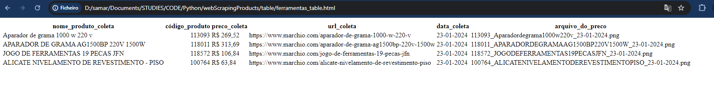
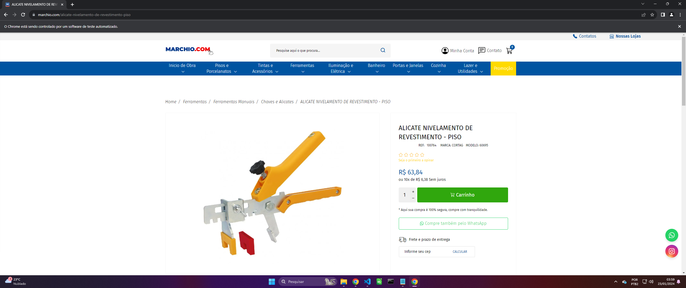

# Web scraping do site [Marchio](https://www.marchio.com/)

Este repositório contém um conjunto de scripts Python destinados a coletar informações do site [Marchio](https://www.marchio.com/). O objetivo principal é realizar a raspagem de dados de uma categoria específica, coletando detalhes dos produtos, tirando screenshots e estruturando os resultados em tabelas visíveis tanto no HTML como no terminal.

***

## Conteúdo

1. [Estrutura do Projeto](#estrutura-do-projeto)
2. [Como Utilizar](#como-utilizar)
   - [Setup do projeto](#setup-do-projeto)
3. [Estrutura de Diretórios](#estrutura-de-diretórios)
4. [Resultados](#resultados)
    - [Exemplo de uma tabela](#exemplo-de-uma-tabela)
    - [Exemplo de um screenshot](#exemplo-de-um-screenshot)
5. [Autora do projeto](#autora)

***

## Estrutura do Projeto

O projeto é estruturado da seguinte forma:

```
WebScrapingProducts/
|-- docs/
|   |-- menu.png
|   |-- table_html.png
|   |-- table_terminal.png
|-- env/
|-- screenshots/
|   |-- 100764_ALICATENIVELAMENTODEREVESTIMENTOPISO_23-01-2024.png
|   |-- 113093_Aparadordegrama1000w220v_23-01-2024.png
|   |-- 118011_APARADORDEGRAMAAG1500BP220V1500W_23-01-2024.png
|   |-- 118572_JOGODEFERRAMENTAS19PECASJFN_23-01-2024.png
|-- table/
|   |-- ferramentas_table.html
|   |-- tintas-e-acessorios_table.html
|-- .gitignore
|-- categories.py
|-- .LICENSE
|-- main.py
|-- menu_utils.py
|-- pagination_utils.py
|-- products.py
|-- README.md
|-- requirements.txt
|-- screenshot_utils.py
|-- table_utils.py
|-- webdriver_setup.py
```
***

## Como Utilizar

Antes de começar, você vai precisar ter instalado em sua máquina as seguintes ferramentas:

[Git](https://git-scm.com), [Python](https://www.python.org/) e [Pip](https://pypi.org/). 

Além disto, é necessário ter um editor de código que aceite trabalhar com a linguagem Python como [VSCode](https://code.visualstudio.com/)

### Setup do projeto

1. Clone o repositório:
 ```
git clone https://github.com/sammytrindade/WebScrapingProducts
```
   
2. Crie um ambiente virtual:
 ```
python -m venv env 
```
3. Ative o ambiente:
 ```
.\env\Scripts\activate.ps1
```
4. Instale as dependências do projeto pelo arquivo: `requirements.txt`
```
pip install -r requirements.txt
```
5. Execute o projeto:
```
python main.py
```
6. Selecione a categoria dos produtos:


***

## Estrutura de Diretórios

[docs](docs/) Diretório para armazenar os documentos e imagens utilizados no projeto.

[screenshots](screenshots/) Diretório para armazenar os screenshots dos produtos coletados.

[table](table/) Diretório para armazenar as tabelas em formato HTML.

## Resultados
Os resultados da coleta, incluindo screenshots e tabelas HTML, serão armazenados nos diretórios mencionados acima. 

### Exemplo de uma tabela:



***

### Exemplo de um screenshot:



Além disso, durante a execução, o usuário será informado sobre o progresso da coleta pelo terminal.


<br /> Aproveite o WebScrapingProducts! 🚀


***
***

### Autora

<a href="https://www.linkedin.com/in/samaratrindade/">
 
 <br /><sub><b>Samara Trindade</b></sub></a> <a href="https://www.linkedin.com/in/samaratrindade/" title="Linkedin"></a>🚀


<br />Feito com 💙 por Samara Trindade 👋🏽 Entre em contato!

[](https://www.linkedin.com/in/samaratrindade)
[](https://twitter.com/sammytrindade)
[](mailto:samaratrindaderibeiro@hotmail.com)

